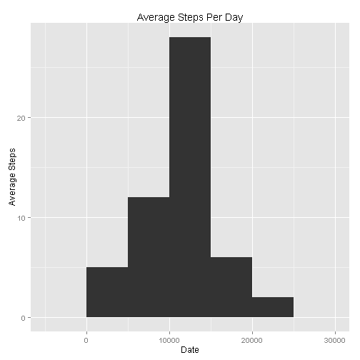

#This is for Reproducible Research: Peer Assessment 1
By - Tariq M. Salameh on 14 May 2015


#Introduction
This is the first assigment that should be submitted to be evaluated by peers in the class, the goal of it is mainly to test Kniter capabilities and to enable reproduceability for research

# Section - Loading and preperation

The following will load all required libraries a long with checking the address the is required to place you data, we will download data, load it, then preprocess it to make it ready for analysis


```r
#loading library
library(lubridate ) 
library(plyr)
library(dplyr)
library(ggplot2)
#data loading and prepreation
setwd("D:/temp-vm/Incremental/RScript/Producable Research/");
file_url<-"https://d396qusza40orc.cloudfront.net/repdata%2Fdata%2Factivity.zip"
if(!file.exists("./RepData_PeerAssessment1")){dir.create("./RepData_PeerAssessment1")}
setwd("D:/temp-vm/Incremental/RScript/Producable Research/RepData_PeerAssessment1");

filename<- "repdata-data-activity.zip"
filename1 <- "./repdata-data-activity/activity.csv"

if (!file.exists(filename) | !file.exists(filename1)) {
temp <- tempfile()
download.file(file_url, temp)
unzip(temp)
}

activity_monitoring <- read.csv(file = filename1, header = TRUE,sep = ",");
activity_monitoring$date <- ymd(activity_monitoring$date)

if(!file.exists("./RepData_PeerAssessment1/figure")){dir.create("./RepData_PeerAssessment1/figure")}
```

# Section - What is mean total number of steps taken per day?

The following code will do the required calculation to get the Means of Steps Per Day


```r
#Step - What is mean total number of steps taken per day?


MS_Per_Day<-activity_monitoring %>% filter(!is.na(steps)) %>% group_by(date) %>% summarize(totalpDay=sum(steps,na.rm = TRUE))
```


##Ploting it

The following will generate a plot using ggplot2 library to show histogram of total number of steps taken per day


```r
ggplot(data = MS_Per_Day, aes(totalpDay)) + geom_histogram(binwidth=5000)+xlab("Date")+ylab("Average Steps")+labs(title="Average Steps Per Day")
```

 

##Calculate and report the mean and median of the total number of steps taken per day

The mean for total number of steps taken per day is 1.0766 &times; 10<sup>4</sup>
The median for total number of steps taken per day is 10765


The following we obtained these resulst

```r
mean(MS_Per_Day$totalpDay)
```

```
## [1] 10766
```

```r
median(MS_Per_Day$totalpDay)
```

```
## [1] 10765
```


# Section - What is the average daily activity pattern?

##Which 5-minute interval, on average across all the days in the dataset, contains the maximum number of steps?

First prepare the data set calculation by group by interval then do the summarization for the mean and total number of steps 


```r
MS_Per_Interval<-activity_monitoring %>% group_by(interval) %>% summarize(avg=mean(steps,na.rm = TRUE),total=sum(steps,na.rm = TRUE))
```

The following will plot the steps using line diagram


```r
qplot(x=interval,y=steps,stat="summary",fun.y="mean", data = activity_monitoring,geom="line")+labs(title="Average steps per interval")
```

```
## Warning: Removed 2304 rows containing missing values (stat_summary).
```

 


As you can see from the diagram and based on the following script , the interval with max number of steps per days is 835 , and the follwing how we did the caluculation:


```r
MS_Per_Interval %>% filter(avg==max(MS_Per_Interval$avg)) %>% select(interval,avg)
```

```
## Source: local data frame [1 x 2]
## 
##   interval   avg
## 1      835 206.2
```

#Section - Imputing missing values

Tthe strategy for filling in all of the missing values in the dataset. will be using the mean for  for that 5-minute interval.


first, I will create the merged data set that contains both na and avg steps interval values along


```r
imputed_data<-activity_monitoring 
merged_data<-merge(x = imputed_data,y=MS_Per_Interval,by.x = "interval",by.y="interval")
```

Secondly, I will use mutate capabiltites to enrich data using ifelse statement to overwrite the value if it is NA

```r
imputed_merged_data<-merged_data %>% mutate(steps=ifelse(is.na(steps),avg,steps)) %>% select(steps,date,interval)%>%arrange(date,interval)
```


The following will generate the average of steps per day for imputed result set and plot it as well:

```r
ID_MS_Per_Day<-imputed_merged_data %>% filter(!is.na(steps)) %>% group_by(date) %>% summarize(totalpDay=sum(steps,na.rm = TRUE))

ggplot(data = ID_MS_Per_Day, aes(totalpDay)) + geom_histogram(binwidth=5000)+xlab("Date")+ylab("Average Steps")+labs(title="IMputed Missing data -Average Steps Per Day")
```

 


Now, we want to report the mean and the median and compare if it is different than unimputed one

The mean for total number of steps taken per day is 1.0766 &times; 10<sup>4</sup>
The median for total number of steps taken per day is 1.0766 &times; 10<sup>4</sup>


The following we obtained these resulst

```r
mean(ID_MS_Per_Day$totalpDay)
```

```
## [1] 10766
```

```r
median(ID_MS_Per_Day$totalpDay)
```

```
## [1] 10766
```


As you can see there is no change in mean however there is a slight change in median

#Step - Are there differences in activity patterns between weekdays and weekends?

Create a new factor variable in the dataset with two levels - "weekday" and "weekend" indicating whether a given date is a weekday or weekend day. therefoe the following code will do the required prepreation and generating the dataset along with day is weekday or weekend.


```r
imputed_merged_data <- imputed_merged_data%>% mutate(weekday=weekdays(date)) %>% mutate(daytype = ifelse(weekday %in% c("Saturday","Sunday"),"Weekend","Weekday"))
```


The following will calculate the mean for steps per interval and daytype
  
  ```r
   avg_per_daytype_interval<-imputed_merged_data %>% group_by(daytype,interval) %>% summarize(avg=mean(steps))
  ```


The following will do the plotting for average steps per daytype or interval

```r
ggplot(data=avg_per_daytype_interval,aes(x = interval,y=avg)) +geom_line()+facet_wrap(~daytype,nrow=2,ncol=1)+labs(title="Average steps per interval for weekday type")
```

 


As you can see in the weekend there is relatively higher average number of steps in the middle year interval compared to weekday, on otherhand, in the weekday there is significant higher number of average of steps in the morning interval 
